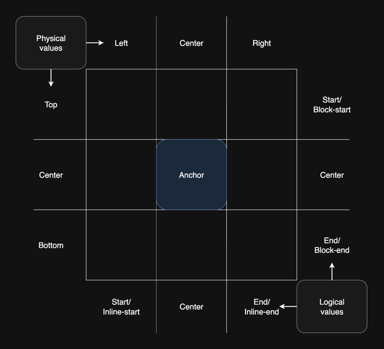
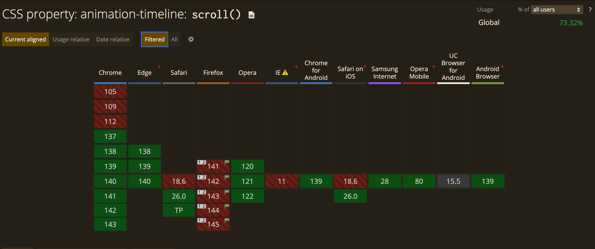

# JavaScript, отдохни! Делаем интерактивные вещи на HTML и CSS

## Вступление

Как часто вы интересуетесь современными возможностями CSS и HTML? Думаете, что нового там ничего не появится, или что новые фишки не поддерживаются браузерами? Это мнение давно устарело. Современный HTML и CSS позволяют реализовывать интерактивные элементы, которые раньше были доступны только с помощью JavaScript. Можно сказать, что границы между разметкой, стилями и программированием постепенно стираются.

На написание этой статьи меня подтолкнуло большое количество новых возможностей в современном HTML и CSS, да и не только современные: некоторые приёмы, о которых знают немногие, поддерживались ещё со времён IE. Многие по привычке используют готовые решения или Tailwind CSS, опасаясь изучать что-то новое.

Я собрал компиляцию полезных практик, оформил их в сокращённом текстовом виде.

## Выделение фрагмента текста

Если перед вами стоит задача - по клику на какую-либо кнопку или при переходе по какой-либо ссылке подсветить фрагмент текста, например, при реализации поиска. Для реализации этой задачи достаточно использовать только HTML.

Вы уже знаете, что через атрибут `href` у ссылки можно: 
* вызвать почтовый клиент через `mailto:`,
* набрать номер телефона через `tel:`,
* написать смс при помощи `sms:`.

А ещё есть возможность выделить текст на странице через указание в ссылке `:~:`.

Разберем подробнее, как с этим работать:  
Текстовые фрагменты обычно записываются в ссылке после `#`.
* `:~:` - это последовательность символов, известная как директива фрагмента, сообщает браузеру, что далее следует одна или несколько инструкций,
* `text=` - это текстовая директива, предоставляет браузеру текст, который должен быть связан с документом,
* `textStart` (необязательный) - указывает на начало связанного текста,
* `textEnd` (необязательный) - указывает на конец связанного текста,

Пример использования:
```html
<a href="#:~:text=Выделяемый текст">Выделить фрагмент текста</a>
```

Для стилизации выделенного текста можно использовать псевдокласс `::target-text`. [Посмотрите на пример реализации](https://codepen.io/klekovvlad/pen/ogjJMVr).

## Оптимизация загрузки изображений

Предположим, что перед вами стоит задача сделать страницу с галереей изображений. Заказчик хочет показать на странице все две тысячи его классных фотографий. Как поступить, чтобы пользователю не загружать сразу такой большой объем данных?

Если вы знакомы с реализацией виртуальных списков через подписку на прокрутку или того лучше - браузерным API `Intersection Observer API` - то это отлично, но требует кода на JS, а статья как раз о том, чтобы его избежать.

У `` и `<iframe>` тегов доступен атрибут `loading`, если в него указать значение `lazy`, то браузер самостоятельно загрузит его после попадания в `visual viewport`.

Пример использования.
```html

```

Атрибут имеет широкую поддержку у всех популярных браузеров, можно смело использовать уже сейчас.


## Реализация якорных ссылок

Если вам требуется по клику на кнопку или ссылку плавно доскролить до определенного элемента, я надеюсь, что вы уже использовали якорные ссылки и `scroll-behavior: smooth`.
```css
    html {
        scroll-behavior: smooth;
    }   
```


```html
    <a href="#target">Ссылка</a>
    <div id="target">Элемент</div>
```
Но, если на вашем проекте используется хедер, который всегда закреплен сверху и по клику на ссылку перекрывает начало контента, возможно, вы решите (или уже решили), что стандартные якорные ссылки уже не подходят и нужно решать задачу иначе - считать сколько пикселей до элемента, получать высоту хедера суммировать их и прокручивать через JavaScript.
Однако, в современном CSS доступны свойства `scroll-margin-top` и `scroll-padding-top`, это работает аналогично свойствам `margin` и `padding`, только для скролла. Значением это свойства может быть высота хедера плюс еще пару пикселей для красоты.
```css
    .item {
        scroll-margin-top: 60px
    }   
```
Весомым преимуществом использование данного подхода является также возможность стилизовать элемент через псевдокласс `:target`. [Посмотрите демо](https://codepen.io/klekovvlad/pen/PwPxooP), это свойство отлично решает проблему `sticky`-шапок. Поддержка тоже широкая, если у вас еще не осталось пользователей на IE.


## Реализация тултипа

Для реализации простого тултипа, цель которого показать текст при наведении на элемент, нам тоже не потребуется JavaScript. Данную задачу мы можем реализовать используя только один HTML элемент и псевдоэлемент `::before` или `::after`. 
 
Знаете ли вы, что в CSS свойство `content` у псевдоэлементов можно задать не только пустую строку, строку со значением или ссылку до изображения, но и можем вывести значение атрибута элемента.

```html
<p data-tooltip="Текст внутри тултипа">Элемент</p>
```

Для реализации текущей задачи нужно значением какого-либо атрибута (отлично подходят `data-`атрибуты) задать текст, который нужно показывать при наведении. А у псевдоэлемента `::before` или `::after`, который по умолчанию скрыт через CSS (любым удобным вам способом), добавляем свойство `content` со значением `attr(data-tooltip)`. Показать тултип можно стилизовав у основного HTML элемента псевдокласс `:hover`. [Посмотрите демо](https://codepen.io/klekovvlad/pen/ZYbmYNb), функцию `attr()` у псевдоэлементов поддерживает даже IE.


## Реализация модального окна

Сколько нужно JavaScript-кода, чтобы создать семантичный и доступный модальный диалог, который закрывается по `Esc` и по клику на backdrop?
Если ваш ответ - чуть больше, чем одна строка, то вас удивит возможность реализовать это почти без JavaScript — используя элемент нативный браузерный HTML элемент `<dialog>`.

Пример реализации.
```html
<button onclick="dialog.showModal()">Открыть модалку</button>

<dialog id="dialog" closedby="any">
  Я - модалка
  
  <form method="dialog">
    <button>Закрыть модалку</button>
  </form>
</dialog>
```

Нативный HTML элемент `<dialog>` поддерживает следующие методы:
 * `showModal()` - показывает диалог, как модальное окно с фоном (backdrop),
 * `show()` - показывает диалог, как модальное окно,
 * `close()` - закрыть диалог, можно также передать возвращаемое значение.

[На примере реализации](https://codepen.io/klekovvlad/pen/pvjQoBO) видно еще один способ закрыть элемент `<dialog>` - внутри него вызвать событие `submit` на форме с методом `dialog`.

Для того чтобы расширить возможности закрытия HTML-элемента `<dialog>` можно указать различные значения атрибута `closedby`:  
* `any` - Закрывать по клику на backdrop и по нажатию на клавишу `Esc`, либо через указание явного механизма закрытия (вызов метода, вызов `submit` на форме внутри),
* `none` - Закрыть модальное окно можно только через явное указание механизма закрытия,
* `closerequest` - Является значением по умолчанию, закрывается по нажатию на клавишу `Esc`, либо через указание явного механизма закрытия.

Для стилизации элемента мы можем стилизовать и backdrop самого диалога, для этого у нас есть псевдоэлемент ```::backdrop```, а также сам элемент имеет псевдокласс ```:open```, если браузер не поддерживает псевдокласс `:open` (например мобильный Safari), то можно стилизовать через наличие атрибута `dialog[open]`. Для реализации плавного появления элемента, нам может помочь правило `@starting-style` и немного анимаций, [как мы реализовали на примере](https://codepen.io/klekovvlad/pen/pvjQoBO).

```css
@starting-style {
  dialog[open] {
    opacity: 0;
    transform: translate(0, 50px);
  }
}

dialog[open] {
    opacity: 1;
    transform: translate(0, 0);
}
```

Правило `@starting-style` имеет широкую поддержку у всех популярных браузеров, как и HTML элемент `<dialog>`. Рекомендую уже пробовать использовать на своих проектах.


## Реализация popover

В современном HTML есть возможность показывать и скрывать элементы по клику без написания кода на JavaScript.

В этой части статьи речь пойдёт о Popover API. С помощью пары атрибутов элементов можно сделать всплывающее окно. Основная разница с вышеупомянутым `<dialog>`, что это не просто HTML элемент, а полноценный браузерный API.

```html
<div id="popover" popover>Я поповер</div>
<button popovertarget="popover">Открыть поповер</button>
```

Атрибут popover превращает элемент в поповер, которому нужно задать уникальный идентификатор. Кнопке нужно добавить атрибут `popovertarget`, значением атрибута является идентификатор элемента, который будет открываться.

Также, как и у `<dialog>`, у элемента с атрибутом popover есть псевдоэлемент `::backdrop` и псевдокласс `:popover-open`. Это даёт достаточно возможностей для стилизации вместе с использованием вышеупомянутого правила `@starting-style`.   

`Popover API` поддерживает различные типы поведения:
* `auto` - значение по умолчанию, поповер закрывается по клику вне области, либо по нажатию на `Esc`,
* `manual` - поповер закрывается только программно через специальные атрибуты.

Пример реализации закрытия через атрибут `popovertargetaction`:
```html
<button popovertarget="popover" popovertargetaction="hide">Закрыть</button>
```
Атрибут `popovertargetaction` принимает следующие значения:
* `show` - открывает поповер,
* `hide` - закрывает поповер,
* `toggle` - переключает состояние.

Если вам недостаточно управления элементом через HTML-атрибуты, вы можете также пользоваться следующими методами:
* `hidePopover()` - скрывает окно, удаляя его из верхнего слоя, применяет `display: none`,
* `showPopover()` - отображает элемент, добавляя его на верхний слой,
* `togglePopover()` - переключает состояния.

Также вы можете подписаться на события:
* `beforetoggle` - вызывается непосредственно перед изменением состояния всплывающего элемента в обе стороны, может использоваться для предотвращения открытия элемента, либо для обновления других элементов,
* `toggle` - вызывается сразу после изменения состояния поповера.

[Посмотрите на реализацию](https://codepen.io/klekovvlad/pen/GgpPOpb), атрибут имеет хорошую поддержку у современных браузеров.


## Anchor Positioning

Использование модуля якорного позиционирования в CSS предоставляет функции, которые позволяют связывать элементы между собой. Как часто вам приходилось позиционировать один элемент относительно другого, например, для реализации выпадающего меню, поповера или тултипа? Для этих задач отлично подходят новые возможности CSS - `Anchor Positioning`. Элементы с якорным позиционированием могут иметь размер и положение, заданные в зависимости от размера и расположения якорных элементов, с которыми они связаны.

Для реализации явной привязки одного элемента к другому нужно задать для него имя в свойстве `anchor-name`.
```css
.parent {
  anchor-name: --my-anchor;
}
```

Чтобы привязать дочерний элемент относительно родителя, нужно задать абсолютное или фиксированное позиционирования `position: absolute` или `fixed`. И указать значение имени родителя в свойстве `position-anchor`.
```css
.anchor {
  position: fixed;
  position-anchor: --my-anchor;
}
```

Теперь для более точного расположения дочернего элемента относительно родительского мы можем использовать функцию `anchor()`, которая принимает в себя следующие параметры:
* `<anchor-name>` - имя якоря, относительно которого считается позиционирование,
* `<anchor-side>` - задаёт положение относительно стороны или боковых сторон якоря. Допустимые значения включают в себя физические `top`, `bottom`, `center` и т.д., либо логические `start`, `end`, `self-end` и т.д., а также можно указать процентное соотношение от 0% до 100% относительно горизонтальной оси,
* `<fallback>` - определяет расстояние, которое используется в качестве запасного варианта, если элемент не имеет абсолютного или фиксированного позиционирования, если используемое значение `<anchor-side>` несовместимо.

```css
.children {
    position: fixed;
    position-anchor: --my-anchor;
    top: anchor(self-end);
    left: anchor(start)
}
```

Для более гибкого позиционирования с учетом направления письма вместо `top` и `left` вы можете использовать эквивалентные свойства `inset-block-start` и `inset-inline-start`.

Альтернативой позиционирования через функцию `anchor()` является свойство `position-area`. Оно работает по принципу сетки из плиток 3x3, где центральный элемент является якорным. Свойство position-area можно использовать для позиционирования якорного элемента в любой из девяти плиток или для его размещения на двух или трёх плитках.



Значения свойств состоят из одного или двух значений, основанных на значениях строк и столбцов, описанных выше. Доступны параметры охвата, позволяющие определить область сетки, в которой должен располагаться элемент. 
```css
.children {
  position: fixed;
  position-anchor: --my-anchor;
  position-area: top;
}
```

Для более точного выравнивания дочернего элемента относительно якоря посередине вы можете использовать значение `anchor-center` для свойств `justify-self`, `align-self`, `justify-items`, `align-items` (и их сокращённые варианты `place-items` и `place-self`).

```css
.children {
  position: fixed;
  position-anchor: --my-anchor;
  top: anchor(top);
  justify-self: anchor-center;
}
```

Чтобы выровнять дочерний элемент относительно якоря, вы можете использовать для любого из свойства размера `width`, `height`, `min-width` и т.д. функцию `anchor-size()`, которая принимает в себя следующие параметры: 
* `<anchor-name>` - имя якоря,
* `<anchor-size>` - указывает размер родительского элемента. Это можно выразить с помощью физических (`width` или `height`) или логических (`inline`, `block`, `self-inline` или `self-block`) значений.
* `<length-percentage>` - указывает размер, который будет использоваться в качестве запасного варианта, если элемент не имеет абсолютного или фиксированного позиционирования, или если родителя не существует.

```css
.children {
  width: anchor-size(width);
}
```

Использовать `Anchor Positioning` будет полезно для большого количества разных задач. Мы имеем достаточно простой и понятный синтаксис и много разных возможностей. Например, это отличное решение для реализации поповера совместно с `Popover API` [посмотрите демо](https://codepen.io/klekovvlad/pen/yyYGPVb). К сожалению, поддержка на данный момент слабовата


## Реализация карусели

Если перед вами стоит задача показать несколько HTML элементов в один ряд, которые можно скроллить, не обязательно использовать тяжеловесные библиотеки типа SwiperJs.  

Для решения такой задачи вам может подойти и обычное решение на CSS. Для начала нам нужно подготовить разметку, добавляем родителя и внутри любое количество дочерних элементов:

```html
<div class="carousel">
  <div class="carousel-item">
  </div>
  <div class="carousel-item">
  </div>
  <div class="carousel-item">
  </div>
  <div class="carousel-item">
  </div>
    ...
</div>
```

Чтобы наши элементы выстроились в один ряд, лучше всего использовать свойство `display` со значением `flex` или `grid`. В текущем примере я буду использовать `flex`:
```css
.carousel {
  display: flex;
  align-items: stretch;
  justify-content: flex-start;
  gap: 20px;
  overflow: auto;
}
```
Через свойство `align-items` со значением `stretch` мы растягиваем все дочерние элементы по высоте, а свойство `gap` определяет отступы между карточками, без необходимости убирать этот отступ у последней карточки, если бы мы использовали `margin-right`. Свойство `overflow` со значением `auto` добавляет в наш элемент скролл, если есть такая необходимость.

Также мы добавим немного стилей для дочерних элементов:
```css
.carousel-item {
    flex: 0 0 400px;
}
```

Основная задача для свойства `flex-shrink` установить значение `0`, а также выставить размер для карточки, в текущем случае устанавливаем в свойство `flex-basis` значение `400px`, это необязательно, если внутри элемента есть какой-либо контент.

Этого достаточно, чтобы разместить элементы в один ряд и ваша задача уже практически решена, но ваш заказчик хочет более похожего на карусель поведения, чтобы дочерние элементы "прилипали" к левой стороне. Для этого нам также не потребуется использовать JavaScript, нужно добавить еще несколько CSS свойств.

Для родителя необходимо добавить:
```css
.carousel {
  overscroll-behavior-x: contain;
  scroll-snap-type: x mandatory;
}
```

Разберем подробнее, первое свойство `overscroll-behavior-x` определяет поведение браузера при достижении конца горизонтальной прокрутки, принимает следующие значения:
* `auto` - поведение по умолчанию, вы можете заметить, если вы прокручиваете контент внутри модального окна и контент заканчивается, браузер может начать прокручивать страницу,
* `contain` - поведение, которое не передает прокрутку на другие элементы, а поведение при переполнении прокрутки возникает только на текущем элементе,
* `none` - цепочка прокрутки не распространяется на соседние области прокрутки, а поведение при переполнении по умолчанию не используется.

Второе по порядку, но первое по значимости свойство `scroll-snap-type` - свойство определяющее направление и строгость привязки прокрутки внутри контейнера. Принимает следующие значения:
* `x` - привязка по горизонтальной оси,
* `y` - привязка по вертикальной оси,
* `inline` - привязка по линейной оси,
* `block` - привязка по оси блока,
* `both` - контейнер привязывается к фиксированным позициям по обеим осям независимо друг от друга,
* `mandatory` - область просмотра этого контейнера с прокруткой должна фиксироваться в определённом положении, если в данный момент прокрутка не выполняется,
* `proximity` - область просмотра этого контейнера с прокруткой может фиксироваться в определённом положении, если в данный момент прокрутка не выполняется. Браузер сам определяет, будет ли выполняться фиксация, на основе параметров прокрутки.

Также осталось добавить одно свойство для дочерних элементов:
```css
.carousel-item {
  scroll-snap-align: start;  
}
```

Свойство `scroll-snap-align` определяет положение привязки блока как выравнивание его области привязки. Оно принимает следующие значения:
* `start` - выравнивать по началу элемента,
* `center` - выравнивать посередине элемента,
* `end` - выравнивать по концу элемента,
* `none` - не указано положение привязки по этой оси.

[Посмотрите демо](https://codepen.io/klekovvlad/pen/GgpYOpo). 

Такой подход не требует подключения внешних зависимостей, улучшает производительность, а также позволяет реализовать доступную и семантичную карусель, вы больше не ограничены документацией сторонних библиотек. Также это свойство имеет отличную поддержку у современных браузеров. 


В большинстве случаев, такая реализация может полностью покрыть требования заказчика.
При необходимости, можно насыпать немного JS и добавить "зацикленность", "прокрутку по кнопкам" и другие фичи, [пример библиотеки](https://barthy-koeln.github.io/scroll-snap-slider/).


## Реализация светлой и тёмной темы

Если раньше разработчики для переключения светлой и тёмной темы использовали дополнительные классы и добавляли его, например, в `<body>`, чтобы переопределить стили (надеюсь, они уже пользовались CSS-переменными), то теперь для реализации
этой задачи нам отлично подходит относительно новая функция в CSS `light-dark()`.

Функция имеет хорошую поддержку и работает во всех современных браузерах


Для реализации тем нам нужно указать для ```:root``` свойство ```color-scheme``` со значениями поддерживаемых цветовых тем. Оно принимает в себя одно или несколько из следующих ключевых слов:  
* `normal` - элемент не осведомлён о каких-либо цветовых схемах, использует схему по умолчанию,
* `light` - элемент может быть отображён в светлой схеме,
* `dark` - элемент может быть отображён в тёмной схеме.


```css
:root {
    color-scheme: light dark;
}
```

Далее в дело вступает функция `light-dark()`, которая позволяет задать два цвета для свойства, возвращая один из двух вариантов, в зависимости от выбранной темы. По умолчанию, если не указана у элемента `color-scheme`, используется цветовая схема операционной системы. При помощи этой функции удобно записывать CSS переменные, например:

```css
:root {
    color-scheme: light dark;
    --text-color: light-dark(#000000, #FFFFFF);
    --background-color: light-dark(#FFFFFF, #000000)
}
```

Для переключения темы и цвета CSS переменной, нужно только переопределить цветовую схему у элемента. Возможно, вы подумаете, что вам понадобится JavaScript, но тут тоже он не нужен, если вы знаете про псевдокласс ```:has``` (о нем еще будет упоминаться в данной статье). [Посмотрите реализацию](https://codepen.io/klekovvlad/pen/zxvMRKN).

## Ограничение текста

Обрезать текст и поставить многоточие, если текст длинный, частая задача при разработке веб-интерфейсов. Многие разработчики для решения этой задачи использовали JavaScript, обрезая строку на N-количество символов, но было сложно добиться на различных разрешениях экрана ровных, не рваных посередине или в начале строк. Для реализации этой задачи нам потребуется также всего 4 строчки CSS кода:

```css
.text {
  display: -webkit-box;
  -webkit-line-clamp: 3;
  -webkit-box-orient: vertical;  
  overflow: hidden;
}
```
Значение `-webkit-box` может показаться незнакомым - это устаревшая реализация модуля гибкой компоновки бокса, вместо неё сейчас принято использовать `flex`, но именно это значение свойства `display` позволит нам задать максимальное количество строк, через свойство `-webkit-line-clamp` и направление через `-webkit-box-orient`.

Поддержка свойства составляет на момент написания статьи более 95%


Но что, если нам нужно не просто обрезать текст, но и позволить пользователю раскрыть его полностью, а также менять лейбл кнопки, которая раскрывает или скрывает текст? Тут тоже нам не потребуется JavaScript, выше я упоминал о псевдоклассе `:has`. 

Изначально мы также обрезаем текст стилями выше, но добавляем в верстку чекбокс:

```html
    <div class="clamp-toggle">
      <p>В европейских странах вопрос о здоровом питании был поднят давно, и в немецкой, французской, итальянской, греческой кухнях представлено большое количество блюд, которые смело можно отнести к полезной пище. У каждого, кто любит возиться на кухне, есть масса маленьких секретов, которые доводят простые блюда до совершенства. Учеными было потрачено много лет, чтобы установить, какие продукты и когда нужно есть, чтобы всегда быть стройным и здоровыми. Прежде всего стоит сказать, что люди часто путают диетическую и обезжиренную пищу с полезной.</p>
      <label>
        <input type="checkbox" />
      </label>
    </div>
```

Далее нам потребуется добавить стили:
```css
.clamp-toggle p {
  display: -webkit-box;
  -webkit-line-clamp: 3;
  -webkit-box-orient:vertical;  
  overflow: hidden;
}

.clamp-toggle input[type=checkbox] {
  display: none;
}

.clamp-toggle label::after {
  content: 'Раскрыть'
}

.clamp-toggle:has(input[type=checkbox]:checked) p {
  display: block;
}

.clamp-toggle:has(input[type=checkbox]:checked) label::after {
  content: 'Скрыть'
}
```

По умолчанию мы скрываем чекбокс и через псевдоэлемент `::after` задаём текст для ```<label>```. Эта конструкция ```.clamp-toggle:has(input[type=checkbox]:checked)``` говорит дословно браузеру: "Если внутри элемента есть чекбокс, который выбран, примени стили ниже", так мы и меняем текст для лейбла и стили для текста. [Посмотрите на реализацию](https://codepen.io/klekovvlad/pen/vENQdpV).

## Реализация прогресса прокрутки

Для реализации анимаций обычно используют свойство `animation`, где мы указываем наименование анимации `animation-name`, время анимации `animation-delay` и другие свойства. Однако в современном CSS временной шкалой выполнения анимации может быть не только время. Чтобы определить этот параметр, нужно в свойстве `animation-timeline` указать любое из поддерживаемых значений: 
* `none` - анимация не привязана к временной шкале,
* `auto` - значение по умолчанию, анимация привязана к времени;, 

Но самое интересное - возможно передать значением функции:
* `scroll()` - анонимная шкала процесса прокрутки у прокручивающегося родителя текущего элемента,
* `view()` - анонимная шкала просмотра элемента, в зависимости от переданных параметров,
* `<dashed-ident>` - позволяет передать именованную временную шкалу, заранее объявленную через `scroll-timeline-name` или `view-timeline-name`.


В текущей части мы подробней разберем использование `scroll()`. 
```css
    .item {
      animation-timeline: scroll();
    }
```

Параметром функции мы можем передать два значения:

Первым параметром функции передается элемент, прокрутку которого отслеживает браузер:
* `nearest` - значение по умолчанию, ближайший предок текущего элемента, который прокручивается,
* `root` - корневой элемент документа,
* `self` - текущий элемент.

Вторым параметром передается значение оси по которой происходит прокрутка:
* `x` - полоса прокрутки по горизонтальной оси,
* `y` - полоса прокрутки по вертикальной оси,
* `block` - значение по умолчанию, полоса прокрутки перпендикулярна направлению текста,
* `inline` - полоса прокрутки параллельна направлению текста.

В этом случае временная шкала анимации определяется не секундами или любым другим временным отрезком, а тем, насколько вы прокрутили элемент. [Посмотрите на реализацию](https://codepen.io/klekovvlad/pen/VYvVwKo).

На момент написания статьи свойство поддерживается не всеми популярными браузерами.


## Заключение

Я не раскрыл полностью каждую часть этой статьи, более подробно вы можете изучить из источников. Это мой первый опыт написания похожих работ, надеюсь, в скором времени я соберу ещё несколько интересных фич из мира HTML и CSS и напишу вторую часть. Итог этой статьи прост: интересуйтесь новым и пробуйте новое. Используйте инструмент по-назначению.

## Источники

* [MDN. Text fragments](https://developer.mozilla.org/en-US/docs/Web/URI/Reference/Fragment/Text_fragments)
* [MDN. Lazy loading](https://developer.mozilla.org/en-US/docs/Web/Performance/Guides/Lazy_loading)
* [MDN. appearance](https://developer.mozilla.org/en-US/docs/Web/CSS/appearance)
* [MDN. Dialog](https://developer.mozilla.org/en-US/docs/Web/HTML/Reference/Elements/dialog)
* [MDN. Popover API](https://developer.mozilla.org/en-US/docs/Web/API/Popover_API)
* [MDN. Using CSS anchor positioning](https://developer.mozilla.org/en-US/docs/Web/CSS/CSS_anchor_positioning/Using)
* [MDN. view-timeline](https://developer.mozilla.org/en-US/docs/Web/CSS/view-timeline)
* [MDN. animation-timeline](https://developer.mozilla.org/en-US/docs/Web/CSS/animation-timeline)
* [Building a media scroller component](https://web.dev/articles/building/a-media-scroller-component?hl=ru)
* [Никита Дубко — CSS first. Когда JS не нужен](https://www.youtube.com/watch?v=G_GwPX6hM9M)
* [Руки прочь от HTML-программистов!](https://youtu.be/Z_8s7hV7GlI?si=yHOhjugdNGa-riqS)
* [MDN. light-dark](https://developer.mozilla.org/en-US/docs/Web/CSS/color_value/light-dark)
