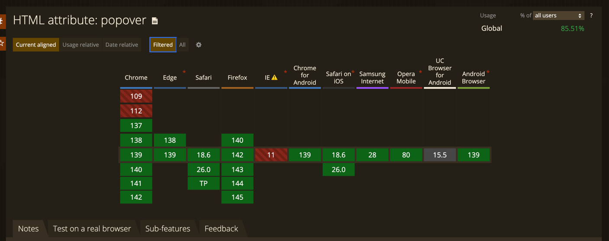
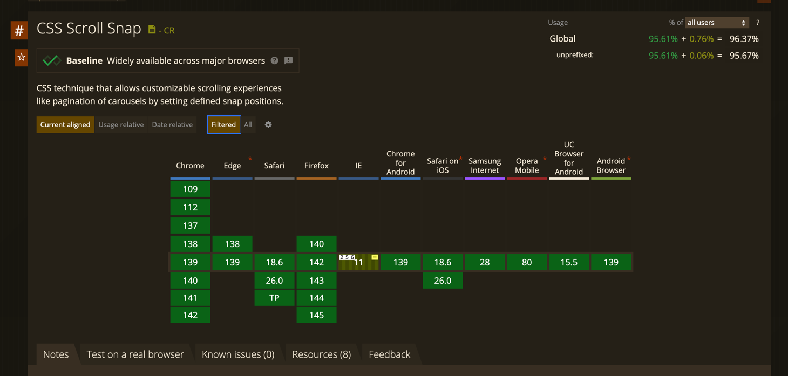

# Вступление

Как часто вы интересуетесь современными возможностями CSS и HTML? Думаете, что нового там ничего не появится, или что новые фишки не поддерживаются браузерами? Это мнение давно устарело. Современный HTML и CSS позволяют реализовывать интерактивные элементы, которые раньше были доступны только с помощью JavaScript. Можно сказать, что границы между разметкой, стилями и программированием постепенно стираются.

На написание этой статьи меня подтолкнуло большое количество новых возможностей в современном HTML и CSS, да и не только в современном, некоторые вещи поддерживаются со времен IE, но о которых знают немногие. Многие по привычке используют готовые решения или tailwind css, опасаясь изучать что-то новое.

Я собрал компиляцию полезных практик, оформил их в сокращённом текстовом виде.

# Выделение фрагмента текста

Для выделения фрагмента текста на странице вам так же может быть достаточно только HTML, знали ли вы, что в ссылку, помимо возможности вызвать почтовый клиент через ```mailto:```, набрать номер телефона через ```tel:``` или написать смс при помощи ```sms:```, есть еще возможность выделить текст на странице через указание в ссылке ```#:~:text=Текст```.

```html
<a href="#:~:text=Выделяемый текст">Выделить фрагмент текста</a>
```

Этот отлично подходит для поиска первой входящей информации на странице. [Демо](https://codepen.io/klekovvlad/pen/ogjJMVr)

# Оптимизация загрузки изображений

Предположим, что перед вами стоит задача сделать страницу с галереей изображений. Заказчик хочет показать на странице все две тысячи его классных фотографий. Как поступить, чтобы пользователю не загружать сразу такой большой объем данных?

Если вы знакомы с реализацией виртуальных списков через подписку на скролл или того лучше - браузерным API ```Intersection Observer API```, то это отлично, но требует кода на JS, а статья как раз о том, чтобы его избежать.

У ```img``` и ```iframe``` тегов доступен атрибут ```loading```, если в него указать значение ```lazy```, то браузер самостоятельно определит, находится ли изображение во вьюпорте и загрузит при необходимости.

```

```

Это, все, нам даже не потребуется css. Поддержка широкая, можно использовать в продакшене.


# Реализация якорных ссылок

Бывали задачи, что вам нужно плавно доскроллить до элемента, кликнув по ссылке?
Я, надеюсь, что в реализации этой задачи вы уже использовали якорные ссылки и ```scroll-behavior: smooth```
```css
    html {
        scroll-behavior: smooth;
    }   
```

```html
    <a href="#anchor">Ссылка</a>
    <div id="anchor">Элемент</div>
```
Но вот незадача, сверху нависла sticky-шапка и она перекрывает контент.
Возможно, вы решите, что стандартные якорные ссылки уже не подходят и нужно решать задачу иначе - считать сколько до элемента, получать высоту хедера и скроллить до него?
Но что, если я скажу на это
```css
    .item {
        scroll-margin-top: 60px
    }   
```
[Демо](https://codepen.io/klekovvlad/pen/PwPxooP) Да, одно это свойство решает проблему sticky-шапки и недосколливает нужное количество пикселей

Поддержка тоже отличная, если у вас еще не осталось пользователь на IE11


# Реализация тултипа

Допустим, ваш заказчик хочет простой тултип, чтобы при наведении мышкой на какой-то элемент всплывала подсказка. Тоже полезли искать метод, который будет рассчитывать координаты и вешать на элемент onMouseEnter?  
А что, если реализовать и эту задачу только через css? Мы даже не будем использовать лишних элементов.
[Демо](https://codepen.io/klekovvlad/pen/ZYbmYNb).

Основная магия - использование псевдоэлемента ```:after``` с атрибутом ```data-tooltip``` (имя вы можете дать любое), да, в свойстве ```content``` может быть не только пустая строка, как вы привыкли использовать, а еще в него можно передать значения атрибута. который по-умолчанию скрыт, но при наведении на родителя показывается. Ховер продолжает работать даже, если пользователь переместит курсор на сам тултип. Стилизовать вы можете это как угодно. Такое решение отлично подходит для создания простых тултипов с подсказками

# Реализация switch-переключателя

Не самая частая задача, но которая тоже может вылиться в некоторые проблемы для разработчика. Нам нужно реализовать доступный элемент, без использования кучи ```<div>``` и самое главное - чтобы это работало (на момент написания статьи Switch в AntDesign 5.27.1 до сих пор является кнопкой внутри который куча html элементов). Чтобы найти легкое решение для этой задачи нужно представить на что из стандартных html элементов похож switch? Очевидно, что обычный чекбокс, у которого есть состояние включить/выключить.

Но, насколько мы знаем, было достаточно сложно или практически невозможно стилизовать дефолтный чекбокс. Или все же ключевое слово БЫЛО и стилизовать теперь можно и его [Демо](https://codepen.io/klekovvlad/pen/myeQJVz).

Основной для реализации похожих элементов является относительно новое свойство ```apperance```, которая отключает дефолтные стили и позволяет стилизировать элемент, так, как хочет того заказчик (или ваше сердце).


# Реализация модального окна

Сколько нужно JavaScript-кода, чтобы создать доступный модальный диалог, который закрывается по ESC и по клику на оверлей?
Если вы думаете, что потребуется много строк, вас удивит возможность реализовать это почти без JavaScript — используя элемент <dialog>.

Эту задачу отлично решает html-элемент ```<dialog>```. Выше я говорил о нескольких символов JS для модалки - они тут:
```onclick="dialog.showModal()```
Тут мы говорим браузеру открыть модалку с идентификатором ```dialog```.  [Вот демо](https://codepen.io/klekovvlad/pen/pvjQoBO)

Этого достаточно — все остальное за вас делает браузер. Если модальное окно открыто, оно автоматически закрывается при нажатии ESC или по клику вне области, если мы передадим атрибут ```closedby="any"```.  

Если вы открыли демо и увидели странную форму с методом ```dialog```, не удивляйтесь, такой метод действительно сущетсвует и сабмит этой формы - закрывает диалог)    

Мы можем стилизовать и бэкдроп самого диалога, для этого у нас есть псевдоэлемент ```::backdrop```  
И сам элемент, а еще можем добавить красивых анимаций, если обратимся к псевдокласу ```:open``` и стилизуем анимации через него    

Поддержка элемента широчайшая


По итогу мы получаем с минимальным колчеством JS нативное, широкоподдерживаемое и доступное модальное окно


# Реализация popover

Еще в современном HTML существует возможность показывать и скрывать какой-либо элемент по клику на другой, для этого вам не придется писать ни одной строчки кода.

В этой части статьи речь пойдет о ```Popover API```, при помощи пары атрибутов элемента можно сделать всплывающее окно

```html
<div id="popover" popover>Я поповер</div>
<button popovertarget="popover">Открыть поповер</button>
```

Атрибут ```popover``` делает элемент, собственно, поповером, ему нужно присвоить идентификатор и в кнопку нужно добавить атрибут ```popovertarget```, куда требуется передать идентификатор элемента, который нужно открыть.

Так же, как и у ```<dialog>``` у элемента с атрибутом ```popover``` есть псевдоэлемент ```::backdrop``` и псевдокласс ```:popover-open```, что дает нам достаточно средств для стилизации. У элемента сразу из коробки доступно закрытие по нажатия на ```Esc``` или по клику вне области элемента.

[Демо](https://codepen.io/klekovvlad/pen/GgpPOpb). Поддержка, в целом, неплохая, можно уже внедрять.


# Anchor Positioning

Как часто вам нужно позиционировать какой-нибудь тултип, поповер или любую выпадающее меню относительно элемента? Для этой задачи уже тоже отлично подходит CSS. Для реализации якорного позиционирования нам нужно к двум элементам - родителю и дочернему добавить пару строк CSS.

```css
.parent {
  anchor-name: --my-anchor;
}

.anchor {
  position: fixed;
  position-anchor: --my-anchor;
  inset-block-start: anchor(self-end);
  inset-inline-start: anchor(start)
}
```

Разберем подробнее. ```anchor-name: --my-anchor;``` задает уникальное имя якорю, далее добавляем дочернему элементу свойство ```position-anchor: --my-anchor;``` с именем родителя и в свойствах определим отступ по-вертикали через ```inset-block-start``` и отступ по-горизонтали через ```inset-inline-start```.

Подробная таблица, как правильно позиционировать.


Еще это свойство отлично работает вместе с вышеупомянутым ```Popover API``` [посмотрите демо](https://codepen.io/klekovvlad/pen/yyYGPVb). Поддержка на данный момент слабовата


# Реализация карусели

Речь пойдет не о сложной реализации карусели, как вы привыкли видеть ее в том же [Swiper](https://www.npmjs.com/package/swiper)
с красивыми эффектами и всевозможными настройками.  
Если вы спросите у заказчика, чего он хочет, а в ответ слышите, что-то похожее: "Хочу карусельку, чтобы с телефона пальцем свайпать, а она красиво скроллилась и прилипала",
то данный параграф будет вам полезен

Реализовать похожее поведение можно несколькими строчками CSS кода.

```css
  .wrapper {
    overflow-x: auto;
    overscroll-behavior-x: contain;
    scroll-snap-type: x mandatory;
  }

  .item {
    scroll-snap-align: start;  
  }
```

[Демо](https://codepen.io/klekovvlad/pen/GgpYOpo). Основная "магия" заключается в свойстве ```scroll-snap-type```, значение ```x mandatory``` говорит:
"Сколь по оси X и прилипай, когда дойдешь до левого края", а ```scroll-snap-align```, говорит "Прилипай по левому краю"

Такой подход не требует подключения внешних библиотек, улучшает производительность и позволяет реализовать доступную карусель, удобно управляемую с мобильного устройства. В большинстве случаев, такая реализация может полностью покрыть требования заказчика.
При необходимости, можно насыпать немного JS и добавить "зацикленность", "сколл по кнопкам" и другие фичи. [Пример библиотеки](https://barthy-koeln.github.io/scroll-snap-slider/)



# Реализация светлой и темной темы

Если раньше разработчики для переключение светлой и темной темы использовали дополнительные классы и добавляли его, например, в body, чтобы переопределить стили (надеюсь, они уже пользовались css переменными), то теперь для реализации
этой задачи нам отлично подходит относительно новая функция в css light-dark().

Функция имеет хорошую поддержку и работает во всех современных браузерах


Для реализации тем нам нужно указать для псевдокласа ```:root``` свойство ```color-scheme``` (у него, кстати. поддержка еще лучше)


```css
:root {
    color-scheme: light dark;
}
```

И чтобы это еще работало, нам нужно указать css переменные, как раз тут и используется функция ```light-dark()```

```css
:root {
    color-scheme: light dark;
    --text-color: light-dark(#000000, #FFFFFF);
    --background-color: light-dark(#FFFFFF, #000000)
}
```

Этого, в целом достаточно, используя такую конструкцию браузер будет автоматически использовать системную тему пользоваля и применять ее к вашему веб-приложению. Но нам же нужно уметь еще и переключать эти темы? 
Для переключения тем нам нужно оставить для родителя нужную нам ````color-scheme````

Возможно, вы подумаете, что вам понадобится JS, но тут тоже он не нужен, если вы знаете про псевдокласс ```:has``` (о нем еще будет упоминаться в данной статье). [Демо](https://codepen.io/klekovvlad/pen/zxvMRKN)

# Ограничение текста

Обрезать текст и поставить многоточние, если текст длинный, частая задача при разработке веб-интерфейсов. Многие разработчики для решения этой задачи использовали JS, обрезая строку на n-количество символов, но было сложно добиться на различных разрешениях экрана ровных не рваных по-середине или в начале строк. Для реализации этой задачи нам потребуется так же всего 4 строчки css кода

```css
.text {
  display: -webkit-box;
  -webkit-line-clamp: 3;
  -webkit-box-orient:vertical;  
  overflow: hidden;
}
```

Поддержка свойства составляет на момент написания статьи более 95%


Но, что, если нам нужено не просто обрезать текст, но и уметь его раскрыть полностью, еще и менять лейбл кнопки, которая раскрывает или скрывает текст? Тут тоже нам не потребуется JS, выше я упоминал о псевдоклассе ```:has```
.   

Изначально мы так же обрезаем текст стилями выше, но добавляем в верстку так же чекбокс

```html
    <div class="clamp-toggle">
      <p>В европейских странах вопрос о здоровом питании был поднят давно, и в немецкой, французской, итальянской, греческой кухнях представлено большое количество блюд, которые смело можно отнести к полезной пище. У каждого, кто любит возиться на кухне, есть масса маленьких секретов, которые доводят простые блюда до совершенства. Учеными было потрачено много лет, чтобы установить, какие продукты и когда нужно есть, чтобы всегда быть стройным и здоровыми. Прежде всего стоит сказать, что люди часто путают диетическую и обезжиренную пищу с полезной.</p>
      <label>
        <input type="checkbox" />
      </label>
    </div>
```

Все, что нужно - добавить эти стили

```css
.clamp-toggle p {
  display: -webkit-box;
  -webkit-line-clamp: 3;
  -webkit-box-orient:vertical;  
  overflow: hidden;
}

.clamp-toggle input[type=checkbox] {
  display: none;
}

.clamp-toggle label::after {
  content: 'Раскрыть'
}

.clamp-toggle:has(input[type=checkbox]:checked) p {
  display: block;
}

.clamp-toggle:has(input[type=checkbox]:checked) label::after {
  content: 'Скрыть'
}
```

По-умолчанию мы скрываем чекбокс и через псевдоэлемент задаем текст для ```label```, эта конструкция ```.clamp-toggle:has(input[type=checkbox]:checked)``` говорит дословно браузеру - "Если внутри элемента есть чекбокс, который выбран, примени стили ниже", так мы и меняем текст для лейбла и стили для текста. [Демо](https://codepen.io/klekovvlad/pen/vENQdpV)

# Реализация прогресса скролла
Я уверен, что вы знакомы со свойством ```animation``` в CSS и даже как-то использовали его для анимирования каких-либо элементов.
Вы уже привыкли, что нужно задать имя анимации, задержку и время выполнения анимации, но что, если я скажу, что таймлайном анимации может быть сколл? И это функция.. Все еще не верите, что CSS - язык програмирования?
  
```css
    .item {
      animation-timeline: scroll();
    }
```

В этом случае временем анимации является не просто секунды или любой другой временной отрезок, а насколько вы прокрутили элемент. 

Тут мы реализовали на чистом css прогресс. [Демо](https://codepen.io/klekovvlad/pen/VYvVwKo)

Кстати, помимо скролла таймлайном может быть так же функция ```view()```, но это уже работает по-другому. View-timeline привязывается не к скроллу, а к тому, насколько элемент находится во вьюпорте, согласитесь, отличное решение для реализации анимаций?

# Заключение

Я не раскрыл полностью каждую часть этой статьи, более подробно вы можете изучить из источников. Это мой первый опыт написания похожих работ, надеюсь, в скором времени, я соберу еще несколько интересных фич из мира HTML и CSS и напишу вторую часть. Итог этой статьи прост - интересуйтесь новым и пробуйте новое. Используйте инструмент по-назначению.

# Источники

* [MDN. Lazy loading](https://developer.mozilla.org/en-US/docs/Web/Performance/Guides/Lazy_loading)
* [MDN. appearance](https://developer.mozilla.org/en-US/docs/Web/CSS/appearance)
* [MDN. Dialog](https://developer.mozilla.org/en-US/docs/Web/HTML/Reference/Elements/dialog)
* [MDN. Popover API](https://developer.mozilla.org/en-US/docs/Web/API/Popover_API)
* [MDN. Using CSS anchor positioning](https://developer.mozilla.org/en-US/docs/Web/CSS/CSS_anchor_positioning/Using)
* [MDN. view-timeline](https://developer.mozilla.org/en-US/docs/Web/CSS/view-timeline)
* [MDN. animation-timeline](https://developer.mozilla.org/en-US/docs/Web/CSS/animation-timeline)
* [Building a media scroller component](https://web.dev/articles/building/a-media-scroller-component?hl=ru)
* [Никита Дубко — CSS first. Когда JS не нужен](https://www.youtube.com/watch?v=G_GwPX6hM9M)
* [Руки прочь от HTML-программистов!](https://youtu.be/Z_8s7hV7GlI?si=yHOhjugdNGa-riqS)
* [MDN. light-dark](https://developer.mozilla.org/en-US/docs/Web/CSS/color_value/light-dark)
