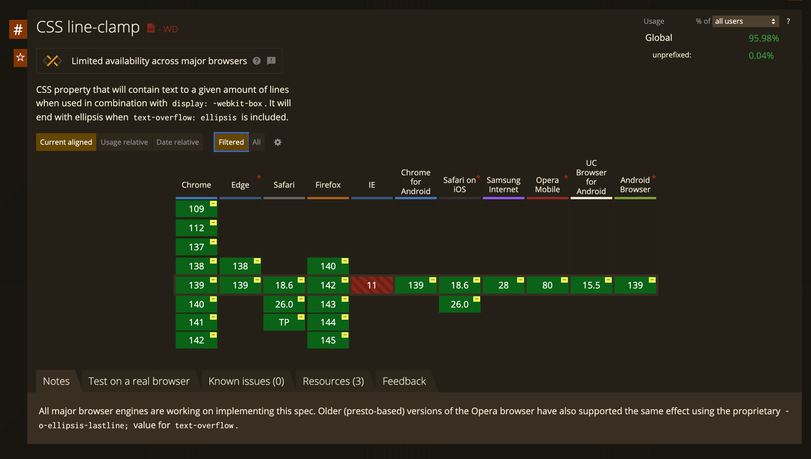

# JavaScript, отдохни! Делаем интерактивные вещи на HTML и CSS

## Вступление

Как часто вы интересуетесь современными возможностями CSS и HTML? Думаете, что нового там ничего не появится, или что новые фишки не поддерживаются браузерами? Это мнение давно устарело. Современный HTML и CSS позволяют реализовывать интерактивные элементы, которые раньше были доступны только с помощью JavaScript. Можно сказать, что границы между разметкой, стилями и программированием постепенно стираются.

На написание этой статьи меня подтолкнуло большое количество новых возможностей в современном HTML и CSS, да и не только в современном, некоторые вещи поддерживаются со времен IE, но о которых знают немногие. Многие по привычке используют готовые решения или tailwind css, опасаясь изучать что-то новое.

Я собрал компиляцию полезных практик, оформил их в сокращённом текстовом виде.

## Выделение фрагмента текста

Если перед вами стоит задача - по клику на какую-либо кнопку или при переходе по какой-либо ссылке подсветить фрагмент текста, например, при реализации поиска. Для реализации этой задачи достаточно использовать только HTML.

Вы уже знаете, что через атрибут ```href``` у ссылки можно: 
* вызвать почтовый клиент через ```mailto:```;
* набрать номер телефона через ```tel:```; 
* написать смс при помощи ```sms:```.

А еще есть возможность выделить текст на странице через указание в ссылке ```:~:```.

Разберем подробнее, как с этим работать:  
Текстовые фрагменты обычно записываются в ссылке после ```#```  
``:~:`` - это последовательность символов, известная как директива фрагмента, сообщает браузеру, что далее следует одна или несколько инструкций;  
``text=`` - это текстовая директива, предоставляет браузеру текст, который должен быть связан с документом;  
``textStart`` (необязательный) - указывает на начало связанного текста;  
``textEnd`` (необязательный) - указывает на конец связанного текста;  

Пример использования:
```html
<a href="#:~:text=Выделяемый текст">Выделить фрагмент текста</a>
```

Для стилизации выделенного текста, можно использовать псевдокласс ```::target-text```. [Посмотрите на пример реализации](https://codepen.io/klekovvlad/pen/ogjJMVr).

## Оптимизация загрузки изображений

Предположим, что перед вами стоит задача сделать страницу с галереей изображений. Заказчик хочет показать на странице все две тысячи его классных фотографий. Как поступить, чтобы пользователю не загружать сразу такой большой объем данных?

Если вы знакомы с реализацией виртуальных списков через подписку на скролл или того лучше - браузерным API ```Intersection Observer API```, то это отлично, но требует кода на JS, а статья как раз о том, чтобы его избежать.

У `````` и ```<iframe>``` тегов доступен атрибут ```loading```, если в него указать значение ```lazy```, то браузер самостоятельно загрузит его после попадания в ``visual viewport``.

Пример использования.
```

```

Атрибут имеет широкую поддержку у всех популярных браузеров, можно смело использовать уже сейчас.


## Реализация якорных ссылок

Если вам требуется по клику на кнопку или ссылку плавно доскролить до определенного элемента, я, надеюсь, что вы уже использовали якорные ссылки и ```scroll-behavior: smooth```.
```css
    html {
        scroll-behavior: smooth;
    }   
```


```html
    <a href="#target">Ссылка</a>
    <div id="target">Элемент</div>
```
Но, если на вашем проекте используется хэдер, который всегда закреплен сверху и по клику на ссылку перекрывает начало контента, возможно, вы решите (или уже решили), что стандартные якорные ссылки уже не подходят и нужно решать задачу иначе - считать сколько пикселей до элемента, получать высоту хедера суммировать это и скроллить через JavaScript.
Однако, в современном CSS доступны свойства ``scroll-margin-top`` и ``scroll-padding-top``, это работает аналогично свойствам ``margin`` и ``padding``, только для скролла. Значением это свойства может быть высота хедера + еще пару пикселей для красоты.
```css
    .item {
        scroll-margin-top: 60px
    }   
```
Весомым преимуществом использовать данных подход является так же возможность стилизовать элемент через псевдокласс ``:target``. [Посмотрите демо](https://codepen.io/klekovvlad/pen/PwPxooP), это свойство отлично решает проблему ``sicky``-шапок. Поддержка тоже широкая, если у вас еще не осталось пользователей на IE.


## Реализация тултипа

Для реализации простого тултипа, цель которого показать текст при наведении на элемент, нам тоже не потребуется JavaScript. Данную задачу мы можем реализовать используя только один HTML элемент и псевдоэлемент ``:before`` или ``after``. 
 
Знали ли вы, что в CSS свойство ``content`` у псевдоэлементов можно задать не только пустую строку, строку со значением или ссылку до изображения, но так же можем вывести значение атрибута элемента.

```html
<p data-tooltip="Текст внутри тултипа">Элемент</p>
```

Для реализации текущей задачи нужно значением какого-либо атрибута (отлично походят ``data-``атрибуты) задать текст, который нужно показывать при наведении. А у псевдоэлемента ``:before`` или ``:after``, который по-умолчанию скрыт через CSS (любым удобным вам способом), добавляем свойство ``content`` со значением ``attr(data-tooltip)``. Показать тултип можно стилизовав у основного HTML элемента псевдокласс ``:hover``. [Посмотрите демо](https://codepen.io/klekovvlad/pen/ZYbmYNb), функцию ``attr()`` у псевдоэлементов поддерживает даже IE.


## Реализация модального окна

Сколько нужно JavaScript-кода, чтобы создать семантичный и доступный модальный диалог, который закрывается по ``Esc`` и по клику на backdrop?
Если ваш ответ - чуть больше, чем одна строка, то вас удивит возможность реализовать это почти без JavaScript — используя элемент нативный браузерный HTML элемент ```<dialog>```.

Пример реализации.
```html
<button onclick="dialog.showModal()">Открыть модалку</button>

<dialog id="dialog" closedby="any">
  Я - модалка
  
  <form method="dialog">
    <button>Закрыть модалку</button>
  </form>
</dialog>
```

Нативный HTML элемент ``<dialog>`` поддерживает следующие методы:
 * ``showModal()`` - показаывает диалог, как модальное окно с фоном (backdrop);
 * ``show()`` - показывает диалог, как модальное окно;
 * ``close()`` - закрыть диалог, можно так же передать возвращаемое значение.

[На примере реализации](https://codepen.io/klekovvlad/pen/pvjQoBO) видно еще один способ закрыть элемент ``<dialog>`` - внутри него вызвать событие ``submit`` на форме с методом ``dialog``.

Для того, чтобы расширить возможности закрыть HTML элемент ``<dialog>`` можно указать различные значения атрибута ``closedby``:  
* ``any`` - Закрывать по клику на backdrop и по нажатию на клавишу ``Esc``, либо через указание явного механизма закрытия (вызов метода, вызов ``submit`` на форме внутри);
* ``none`` - Закрыть модальное окно можно только через явное указание механизма закрытия;
* ``closerequest`` - Является значением по-умолчанию, закрывается по нажатию на клавишу ``Esc``, либо через указание явного механизма закрытия.

Для стилизации элемента, мы можем стилизовать и backdrop самого диалога, для этого у нас есть псевдоэлемент ```::backdrop```, а так же сам элемент имеет псевдокласс ```:open```, если браузер не поддерживает псевдокласс ``:open`` (например мобильный Safari), то можно стилизовать через наличие атрибута ``dialog[open]``. Для реализации плавного появления элемента, нам может помочь правило ``@starting-style`` и немного анимаций, [как мы реализвали на примере](https://codepen.io/klekovvlad/pen/pvjQoBO).

```css
@starting-style {
  dialog[open] {
    opacity: 0;
    transform: translate(0, 50px);
  }
}

dialog[open] {
    opacity: 1;
    transform: translate(0, 0);
}
```

Правило ``@starting-style`` имеет широкую поддержку у всех популярных браузеров, как и HTML элемент ``<dialog>``. Рекомендую уже пробовать использовать на своих проектах.


## Реализация popover

В современном HTML есть возможность показывать и скрывать элементы по клику без написания кода на JavaScript.

В этой части статьи речь пойдёт о Popover API. С помощью пары атрибутов элементов можно сделать всплывающее окно. Основная разница с вышеупомянутым ``<dialog>``, что это не просто HTMl элемент, а полноценный браузерный API.

```html
<div id="popover" popover>Я поповер</div>
<button popovertarget="popover">Открыть поповер</button>
```

Атрибут popover превращает элемент в поповер, которому нужно задать уникальный идентификатор. Кнопке нужно добавить атрибут ``popovertarget``, значением атрибута является идентификатор элемента, который будет открываться.

Также, как и у ``<dialog>``, у элемента с атрибутом popover есть псевдоэлемент ``::backdrop`` и псевдокласс ``:popover-open``. Это даёт достаточно возможностей для стилизации вместе с использованием вышеупомянутого правила ``@@starting-style``.   

``Popover API`` поддерживает различные типы поведения:
* ``auto`` - значение по-умолчанию, поповер закрывается по клику вне области, либо по нажатию на ``Esc``;
* ``manual`` - поповер закрывается только программно через специальные атрибуты.

Пример реализации закрытия через атрибут ``popovertargetaction``:
```html
<button popovertarget="popover" popovertargetaction="hide">Закрыть</button>
```
Атрибут ``popovertargetaction`` принимает следующие значения:
* ``show`` - открывает поповер;
* ``hide`` - закрывает поповер;
* ``toggle`` - переключает состояние.

Если вам недостаточно управления элементом через HTML атрибуты, вы можете так же пользоваться следующими методами:
* ``hidePopover()`` - скрывает окно, удаляя его из верхнего слоя, применяет ``display: none``;
* ``showPopover()`` - отображает элемент, добавляя его на верхний слой;
* ``togglePopover()`` - переключает состояния.

Так же вы можете подписаться на события:
* ``beforetoggle`` - вызывается непосредственно перед изменением состояния всплывающего элемента в обе стороны, может использоваться для предотвращения открытия элемента, либо для обновления других элементов;
* ``toggle`` - вызывается сразу после изменения состояния поповера.

[Посмотрите на реализацию](https://codepen.io/klekovvlad/pen/GgpPOpb), атрибут имеет хорошую поддержку у современных браузеров.


## Anchor Positioning

Как часто вам нужно позиционировать какой-нибудь тултип, поповер или любую выпадающее меню относительно элемента? Для этой задачи уже тоже отлично подходит CSS. Для реализации якорного позиционирования нам нужно к двум элементам - родителю и дочернему добавить пару строк CSS.

```css
.parent {
  anchor-name: --my-anchor;
}

.anchor {
  position: fixed;
  position-anchor: --my-anchor;
  inset-block-start: anchor(self-end);
  inset-inline-start: anchor(start)
}
```

Разберем подробнее. ```anchor-name: --my-anchor;``` задает уникальное имя якорю, далее добавляем дочернему элементу свойство ```position-anchor: --my-anchor;``` с именем родителя и в свойствах определим отступ по-вертикали через ```inset-block-start``` и отступ по-горизонтали через ```inset-inline-start```.

Подробная таблица, как правильно позиционировать.


Еще это свойство отлично работает вместе с вышеупомянутым ```Popover API``` [посмотрите демо](https://codepen.io/klekovvlad/pen/yyYGPVb). Поддержка на данный момент слабовата


## Реализация карусели

Если перед вами стоит задача показать несколько HTML элементов в один ряд, которые можно скроллить, не обязательно использовать тяжеловесные библиотеки типа SwiperJs.  

Для решения такой задачи вам может подойти и обычное решение на CSS. Для начала нам нужно подготовить разметку, добавляем родителя и внутри любое количество дочерних элементов:

```html
<div class="carousel">
  <div class="carousel-item">
  </div>
  <div class="carousel-item">
  </div>
  <div class="carousel-item">
  </div>
  <div class="carousel-item">
  </div>
    ...
</div>
```

Чтобы наши элементы выстроились в один ряд, лучше всего использовать свойство ``display`` со значением ``flex`` или ``grid``. В текущем примере я буду использовать ``flex``:
```css
.carousel {
  display: flex;
  align-items: stretch;
  justify-content: flex-start;
  gap: 20px;
  overflow: auto;
}
```
Через свойство ``align-items`` со значением ``stretch`` мы растягиваем все дочерне элементы по-высоте, а свойство ``gap`` определяет отсутпы между карточками, без необходимости убирать этот отступ у последней карточки, если бы мы использовали ``margin-right``. Свойство ``overflow`` со значением ``auto`` добавляет в наш элемент скролл, если есть такая необходимость.

Так же мы добавим немного стилей для дочерних элементов:
```css
.carousel-item {
    flex: 0 0 400px;
}
```

Основная задача для свойства ``flex-shrink`` установить значение ``0``, а так же выставить размер для карточки, в текущем случае устанавливаем в свойство ``flex-basis`` значение ``400px``, это не обязательно, если внутри элемента есть какой-либо контент.

Этого достаточно, чтобы разместить элементы в один ряд и ваша задача уже практически решена, но ваш заказчик хочет более похожего на карусель поведения, чтобы дочерние элементы "прилипали" к левой стороне. Для этого нам так же не потребуется использовать JavaScript, нужно добавить еще несколько CSS свойств.

Для родителя необходимо добавить:
```css
.carousel {
  overscroll-behavior-x: contain;
  scroll-snap-type: x mandatory;
}
```

Разберем подробнее, первое свойство ``overscroll-behavior-x`` определяет поведение браузера при достижении конца горизонтальной прокрутки, принимает следующие значения:
* ``auto`` - поведение по-умолчанию, вы можете заметить, если вы прокручиваете контент внутри модального окна и контент заканчивается, браузер может начать прокручивать страницу;
* ``contain`` - поведение, которое не передает прокрутку на другие элементы, а поведение при переполнении прокрутки возникает только на текущем элементе;
* ``none`` - цепочка прокрутки не распространяется на соседние области прокрутки, а поведение при переполнении по умолчанию не используется.

Второе по порядку, но первое по значимости свойство ``scroll-snap-type`` - свойство определяющее направление и строгость привязки прокрутки внутри контейнера. Принимает следующие значения:
* ``x`` - привязка по горизонтальной оси;
* ``y`` - привязка по вертикальной оси;
* ``inline`` - привязка по линейной оси;
* ``block`` - привязка по оси блока;
* ``both`` - контейнер привязывается к фиксированным позициям по обеим осям независимо друг от друга;
* ``mandatory`` - область просмотра этого контейнера с прокруткой должна фиксироваться в определённом положении, если в данный момент прокрутка не выполняется;
* ``proximity`` - область просмотра этого контейнера с прокруткой может фиксироваться в определённом положении, если в данный момент прокрутка не выполняется. Браузер сам определяет, будет ли выполняться фиксация, на основе параметров прокрутки.

Так же осталось добавить одно свойство для дочерних элементов:
```css
.carousel-item {
  scroll-snap-align: start;  
}
```

Свойство ``scroll-snap-align`` определяет положение привязки блока как выравнивание его области привязки. Принимает следующие значения:
* ``start`` - выравнивать по началу элемента;
* ``center`` - выравнивать посередине элемента;
* ``end`` - выравнивать по концу элемента;
* ``none`` - не указано положение привязки по этой оси.

[Посмотрите демо](https://codepen.io/klekovvlad/pen/GgpYOpo). 

Такой подход не требует подключения внешних зависимостей, улучшает производительность, а так же позволяет реализовать доступную и семантичную карусель, вы больше не ограничены документацией сторонних библиотек. Так же это свойство имеет отличную поддержку у современных браузеров. 


В большинстве случаев, такая реализация может полностью покрыть требования заказчика.
При необходимости, можно насыпать немного JS и добавить "зацикленность", "прокрутку по кнопкам" и другие фичи, [пример библиотеки](https://barthy-koeln.github.io/scroll-snap-slider/).


## Реализация светлой и темной темы

Если раньше разработчики для переключение светлой и темной темы использовали дополнительные классы и добавляли его, например, в ``<body>``, чтобы переопределить стили (надеюсь, они уже пользовались css переменными), то теперь для реализации
этой задачи нам отлично подходит относительно новая функция в CSS ``light-dark()``.

Функция имеет хорошую поддержку и работает во всех современных браузерах


Для реализации тем нам нужно указать для ```:root``` свойство ```color-scheme``` со значениями поддерживаемых цветовых тем. Оно принимает в себя одно или несколько из следующих ключевых слов:  
* ``normal`` - элемент не осведомлён о каких-либо цветовых схемах, использует схему по-умолчанию;
* ``light`` - элемент может быть отображён в светлой схеме;
* ``dark`` - элемент может быть отображён в темной схеме.


```css
:root {
    color-scheme: light dark;
}
```

Далее в дело вступает функция ``light-dark()``, которая позволяет задать два цвета для свойства, возвращая один из двух вариантов, в зависимости от выбранной темы. По умолчанию, если не указана у элемента ``color-scheme``, используется цветовая схема операционной системы. При помощи этой функции удобно записывать CSS переменные, например:

```css
:root {
    color-scheme: light dark;
    --text-color: light-dark(#000000, #FFFFFF);
    --background-color: light-dark(#FFFFFF, #000000)
}
```

Для переключения темы и цвета CSS переменной, нужно только переопределить цветовую схему у элемента. Возможно, вы подумаете, что вам понадобится JavaScript, но тут тоже он не нужен, если вы знаете про псевдокласс ```:has``` (о нем еще будет упоминаться в данной статье). [Посмотрите реализацию](https://codepen.io/klekovvlad/pen/zxvMRKN).

## Ограничение текста

Обрезать текст и поставить многоточие, если текст длинный, частая задача при разработке веб-интерфейсов. Многие разработчики для решения этой задачи использовали JavaScript, обрезая строку на N-количество символов, но было сложно добиться на различных разрешениях экрана ровных, не рваных по-середине или в начале строк. Для реализации этой задачи нам потребуется так же всего 4 строчки CSS кода:

```css
.text {
  display: -webkit-box;
  -webkit-line-clamp: 3;
  -webkit-box-orient: vertical;  
  overflow: hidden;
}
```
Значение ``-webkit-box`` может показаться незнакомым - это устаревшая реализация модуля гибкой компановки бокса, вместо неё сейчас принято использовать ``flex``, но именно это значение свойства ``display`` позволит нам задать максимальное количество строк, через свойство ``-webkit-line-clamp`` и направление через ``-webkit-box-orient``.

Поддержка свойства составляет на момент написания статьи более 95%


Но, что, если нам нужно не просто обрезать текст, но и позволить пользователю раскрыть его полностью, а так же менять лейбл кнопки, которая раскрывает или скрывает текст? Тут тоже нам не потребуется JavaScript, выше я упоминал о псевдоклассе `:has``. 

Изначально мы так же обрезаем текст стилями выше, но добавляем в верстку так же чекбокс:

```html
    <div class="clamp-toggle">
      <p>В европейских странах вопрос о здоровом питании был поднят давно, и в немецкой, французской, итальянской, греческой кухнях представлено большое количество блюд, которые смело можно отнести к полезной пище. У каждого, кто любит возиться на кухне, есть масса маленьких секретов, которые доводят простые блюда до совершенства. Учеными было потрачено много лет, чтобы установить, какие продукты и когда нужно есть, чтобы всегда быть стройным и здоровыми. Прежде всего стоит сказать, что люди часто путают диетическую и обезжиренную пищу с полезной.</p>
      <label>
        <input type="checkbox" />
      </label>
    </div>
```

Далее нам потребуется добавить стили:
```css
.clamp-toggle p {
  display: -webkit-box;
  -webkit-line-clamp: 3;
  -webkit-box-orient:vertical;  
  overflow: hidden;
}

.clamp-toggle input[type=checkbox] {
  display: none;
}

.clamp-toggle label::after {
  content: 'Раскрыть'
}

.clamp-toggle:has(input[type=checkbox]:checked) p {
  display: block;
}

.clamp-toggle:has(input[type=checkbox]:checked) label::after {
  content: 'Скрыть'
}
```

По-умолчанию мы скрываем чекбокс и через псевдоэлемент ``::after`` задаем текст для ```<label>```, эта конструкция ```.clamp-toggle:has(input[type=checkbox]:checked)``` говорит дословно браузеру - "Если внутри элемента есть чекбокс, который выбран, примени стили ниже", так мы и меняем текст для лейбла и стили для текста. [Посмотрите на реализацию](https://codepen.io/klekovvlad/pen/vENQdpV).

## Реализация прогресса скролла
Я уверен, что вы знакомы со свойством ```animation``` в CSS и даже как-то использовали его для анимирования каких-либо элементов.
Вы уже привыкли, что нужно задать имя анимации, задержку и время выполнения анимации, но что, если я скажу, что таймлайном анимации может быть сколл? И это функция.. Все еще не верите, что CSS - язык програмирования?
  
```css
    .item {
      animation-timeline: scroll();
    }
```

В этом случае временем анимации является не просто секунды или любой другой временной отрезок, а насколько вы прокрутили элемент. 

Тут мы реализовали на чистом css прогресс. [Демо](https://codepen.io/klekovvlad/pen/VYvVwKo)

Кстати, помимо скролла таймлайном может быть так же функция ```view()```, но это уже работает по-другому. View-timeline привязывается не к скроллу, а к тому, насколько элемент находится во вьюпорте, согласитесь, отличное решение для реализации анимаций?

## Заключение

Я не раскрыл полностью каждую часть этой статьи, более подробно вы можете изучить из источников. Это мой первый опыт написания похожих работ, надеюсь, в скором времени, я соберу еще несколько интересных фич из мира HTML и CSS и напишу вторую часть. Итог этой статьи прост - интересуйтесь новым и пробуйте новое. Используйте инструмент по-назначению.

## Источники

* [MDN. Text fragments](https://developer.mozilla.org/en-US/docs/Web/URI/Reference/Fragment/Text_fragments)
* [MDN. Lazy loading](https://developer.mozilla.org/en-US/docs/Web/Performance/Guides/Lazy_loading)
* [MDN. appearance](https://developer.mozilla.org/en-US/docs/Web/CSS/appearance)
* [MDN. Dialog](https://developer.mozilla.org/en-US/docs/Web/HTML/Reference/Elements/dialog)
* [MDN. Popover API](https://developer.mozilla.org/en-US/docs/Web/API/Popover_API)
* [MDN. Using CSS anchor positioning](https://developer.mozilla.org/en-US/docs/Web/CSS/CSS_anchor_positioning/Using)
* [MDN. view-timeline](https://developer.mozilla.org/en-US/docs/Web/CSS/view-timeline)
* [MDN. animation-timeline](https://developer.mozilla.org/en-US/docs/Web/CSS/animation-timeline)
* [Building a media scroller component](https://web.dev/articles/building/a-media-scroller-component?hl=ru)
* [Никита Дубко — CSS first. Когда JS не нужен](https://www.youtube.com/watch?v=G_GwPX6hM9M)
* [Руки прочь от HTML-программистов!](https://youtu.be/Z_8s7hV7GlI?si=yHOhjugdNGa-riqS)
* [MDN. light-dark](https://developer.mozilla.org/en-US/docs/Web/CSS/color_value/light-dark)
